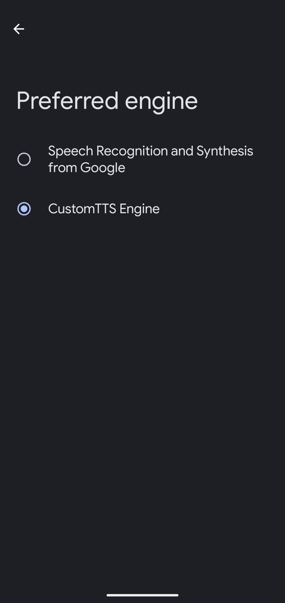

# Custom TTS Service for Android

An Android Text-to-Speech (TTS) engine that connects to configurable OpenAI-compatible API backends (those supporting the `/v1/audio/speech` endpoint format).

This allows you to use custom, self-hosted, or alternative cloud TTS voices (like those powered by Piper, CoquiTTS, local LLMs, or other services offering a compatible API) as a standard system-wide TTS engine on your Android device.

---

**Note:** This README describes the `feature/settings-ui` branch.

---

## Features

* Integrates as a standard Android TTS Engine (selectable in device Settings).
* Connects to your specified backend URL.
* Authenticates using your provided API Key.
* **New in this branch:** In-app Settings screen to configure:
    * Backend URL
    * API Key (stored locally, input masked)
    * TTS Model (e.g., `tts-1`, `tts-1-hd`)
    * TTS Voice (e.g., `alloy`, `nova`)
* Settings are persisted locally using Jetpack DataStore.
* Basic voice mapping based on requested language (can be overridden by settings).

## Configuration

Configuration is now done through the application's user interface:

1.  Build and install the app from this branch.
2.  Open the app.
3.  Navigate to the Settings screen (usually via the settings icon ⚙️ in the top app bar).
4.  Enter your backend URL, API Key, desired TTS Model, and TTS Voice.
5.  Click "Save".

The TTS service will use these saved settings for subsequent synthesis requests.

**Security Note:** Your API key is stored locally on the device using standard DataStore Preferences. For enhanced security, consider using EncryptedSharedPreferences or managing keys more securely if needed.

## Screenshots

 

## Future Work / TODO

* Implement dropdown selection for known Models/Voices in Settings.
* Implement `onStop()` functionality to cancel ongoing network requests.
* More robust error handling and user feedback.
* More sophisticated voice/language mapping.
